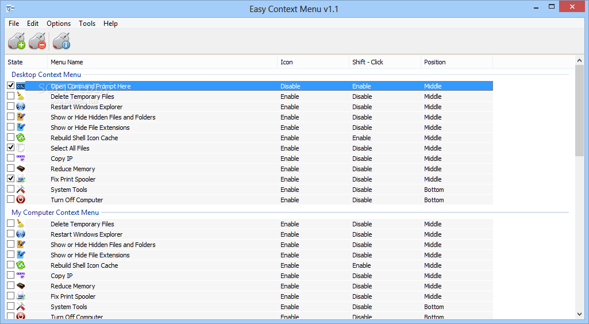
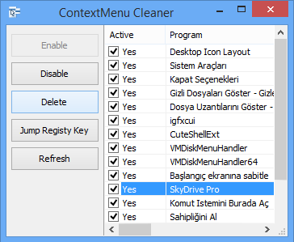
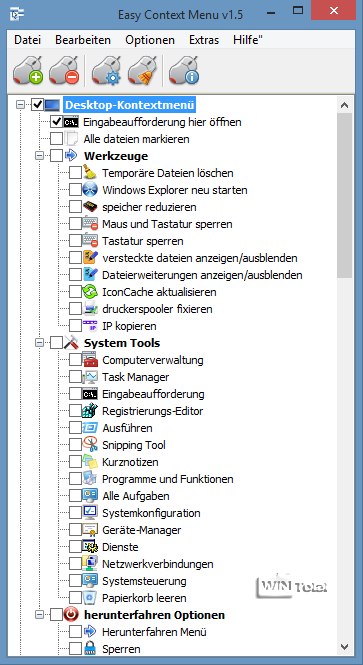

# Easy Context Menu

Easy Context Menu is a free portable utility from Sordum. It adds, removes, or edits commands on the Windows right-click menu. Easy Context Menu Editor is the list tool inside the same zip: drag a program in, give it a title, apply.

easy context menu windows 11 and easy context menu windows 10 share one workflow. Tick Desktop, File, Folder, or This PC. Click Apply Changes. easy context menu v1.6 is the current Sordum zip name people search.

Use the GET badge for this pack. Vendor zip is on the Sordum Easy Context Menu page. Extract it. Run EcMenu.exe or EcMenu_x64.exe. There is no setup wizard.

## Details

Easy Context Menu stays next to its ini. It does not write a Program Files tree. Close the window and the exe is still the product.

The job is the Explorer menu, not a file manager. You still copy files in Explorer. This tool only changes what the right-click list shows.

Easy Context Menu Editor is the custom list. Built-in rows cover Take Ownership, Open with Notepad, delete temp files, and power items. Custom rows are programs you drop in.

A Shift-click row stays hidden until you hold Shift and right-click. Use that for tools you want on the PC but not on every menu.

Pack samples show how a menu host and a registry scan look. They do not install Easy Context Menu. The GET badge or the Sordum zip does.

Menu host sample is [Main.cpp](Main.cpp). Context menu source is [ContextMenu.cpp](ContextMenu.cpp). Menu config sample is [shell.nss](shell.nss).

## Features

- Portable zip, no installer
- Checkboxes under Desktop, File, Folder, This PC
- Easy Context Menu Editor for custom programs
- Take Ownership and Open with Notepad
- Shift-click to hide a row until Shift is down
- Apply Changes writes the menu
- Works on easy context menu windows 11 and easy context menu windows 10
- 64-bit exe for a 64-bit PC

| Piece | What it does |
| --- | --- |
| Easy Context Menu | Tick built-in commands and apply |
| Easy Context Menu Editor | Add a program or a shortcut |
| EcMenu_x64.exe | 64-bit host |
| Portable ini | Settings next to the exe |

Preset command list is [templates.json](templates.json). Crate manifest is [Cargo.toml](Cargo.toml). Site package file is [package.json](package.json).

A row can target one file type or all files. Folder rows do not show on a lone file. Desktop rows do not show inside a folder window.

Do not run two menu editors at once. They fight for the same keys. Close the other tool, then Apply in Easy Context Menu.

## Requirements

Windows 7 and later still open the 1.x zip. Daily use is easy context menu windows 10 and easy context menu windows 11.

64-bit Windows needs EcMenu_x64.exe. A 32-bit leftover exe on a 64-bit PC will miss some keys.

You need write rights on the hive you change. Per-user items stay in HKCU. Machine-wide items ask for elevation once.

A domain image can lock HKLM. Then add only user items, or ask an admin.

rust-toolchain.toml and biome.json are pack manifests. They do not install Easy Context Menu.

Appx sample is AppxManifest.xml. Build helper is build.rs. Export map is Shell.def.

## Services it already knows

Sordum ships a fixed set. Tick what you use. Leave the rest off.

Take Ownership is the usual first tick for a locked folder. Open with Notepad is the usual first tick for a mystery file. Delete Temporary Files is a cleanup row, not a daily click.

Power rows (reboot, shutdown) belong on Desktop if you want them. They do not belong on every file.

Easy Context Menu Editor fills the gap when the built-in list has no row for your tool. Drop the exe. Name it. Apply.

File-manage import sample is [file-manage.nss](imports/file-manage.nss). Jump import sample is goto.nss under imports/. Modify import sample is modify.nss in the same folder.

A dead path still shows until you delete the row. Explorer then says the file is missing. Fix the path. Do not add a second row with the same title.

## What it looks like

The main window is a tree of categories and checkboxes. The editor is a list of titles and commands. Apply is top-left. That is the whole UI.

On easy context menu windows 11 the first right-click can be the short modern list. Use Show more options or Shift+F10 to see classic rows Easy Context Menu wrote. That is a Windows 11 limit, not a missing v1.6 key.

Scan sample is [scan.rs](registry/scan.rs). Windows 11 menu bits are [win11.rs](registry/win11.rs). Write path is write.rs under registry/.

Dark desktop themes do not restyle the Sordum window. The menu in Explorer follows Windows.

A second monitor at another DPI can shift the window. Drag it back. Apply still writes the same keys.

## Documentation

Vendor notes live on the Sordum Easy Context Menu page. This pack is a handbook, not a second shop.

Mirrors on download portals are not Sordum. Prefer the GET badge or the official page.

Settings UI sample is [settings.rs](settings/settings.rs). App start sample is app.rs under settings/. Handler sample is [handler.rs](handler/handler.rs).

Do not paste a machine-local loop address into a custom command. Store a drive path and an exe.

A custom command can take the selected file as an argument. That is how Open with Notepad works. Copy that pattern for your editor.

## Screenshots

People post the checkbox tree and the editor list. The live menu is Explorer after Apply. If the window looks right but the menu does not, you did not click Apply, or another tool overwrote the key.

Control host sample is Control.h next to the pack manifests. Menu header sample is [ContextMenu.h](menu/ContextMenu.h).

A review of easy context menu v1.6 often shows Take Ownership already ticked. That is a demo, not a factory default. Tick only what you want.

## Running

Extract the zip. Run the matching exe. Tick two rows you know. Apply. Right-click the desktop. If the rows are missing, you used the wrong exe bitness or a modern picker hid the classic list.

On easy context menu windows 10 the classic list is the only list. On easy context menu windows 11 check Show more options before you call the zip broken.

One copy only. Two zips extracted in two folders still write the same keys if you Apply in both.

CLI sample is [cli.rs](cli/cli.rs). Favourites sample is favourites.rs under favourites/.

If Apply fails, close Explorer windows and try once more. A locked handle can block a write.

UAC on a machine-wide row is expected. Per-user rows should not ask every time.

## License

Sordum Easy Context Menu uses the vendor license in the zip. One LICENSE file in FILES covers pack samples. Do not add a second LICENSE beside README.

packages.config is a pack manifest. It does not install Easy Context Menu.

## Thanks

Thanks to people who reported missing rows on easy context menu windows 11 and Apply misses after a feature update. This pack is a handbook, not a second vendor.

Language sample is i18n.rs under i18n/. Theme sample is theme.rs under theme/.

Keep the zip. easy context menu v1.6 may get a silent rebuild on the same page. Replace the exe, keep your ini if the format still matches.

A work PC image can wipe HKCU. Export or note your ticks before a reimage.

## Related Questions

**What is the context menu on a computer?**

It is the list that opens when you right-click. On Windows that list is Explorer, the desktop, a file, or a folder. Easy Context Menu edits that list. It does not replace Explorer.

**How can I customize the right-click menu in Windows 11?**

Run Easy Context Menu. Tick the rows you want. Use Easy Context Menu Editor for a program that is not in the built-in list. Apply Changes. Then right-click and open the classic list if Windows 11 shows the short one first.

**Where is the context menu in Word?**

Word draws its own right-click list. Easy Context Menu does not edit ribbon or Word menus. Use Word Options. This tool is for Explorer, desktop, files, and folders.

**How do I get back the context menu in Windows 10?**

If rows vanished, open Easy Context Menu and Apply again. If you hid a row with Shift-click, hold Shift when you right-click. If another tool deleted a key, tick the row and Apply. Windows 10 does not use the Windows 11 short list.

Backup sample is [backup.rs](registry/backup.rs). Do not restore a backup from another menu editor into this zip.

A folder that moved still sits in Easy Context Menu Editor until you edit it. Explorer will then say the path is missing.

Closing the window does not undo Apply. To drop a row, untick it and Apply again.

Sleep or hibernate keeps the menu. You do not restart Easy Context Menu after resume. The keys stay in the registry.

Fast user switch is a second profile. Start Easy Context Menu in that session if you want the same ticks there. The first user keeps their own list.

A VM with no 64-bit guest needs the 32-bit exe. A 64-bit host with a 32-bit guest is not the same as EcMenu_x64.exe on the host.

Safe mode may skip Explorer extensions. Tick rows in a normal session.

A remote desktop session still shows the menu. Apply on that session writes that session's hive if you used HKCU.

High contrast themes still show Explorer menus. If a color is hard to read, that is the theme, not a missing v1.6 feature.

Clicking Apply with nothing ticked can clear rows you thought were stock Windows. Tick carefully. Keep a note of stock items you still want.

Shift-click rows are easy to forget. If a tool vanished, hold Shift and right-click before you re-add it in Easy Context Menu Editor.

direct search names like easy context menu ecmenu and ECM point at the same Sordum exe. There is no second SKU.

Open with Notepad on a huge binary is a bad idea. Keep that row for text. Add your hex tool as a separate editor row.

Take Ownership on a system folder can break updates. Use it on a data folder you own, not on Windows\System32.

Delete Temporary Files is a cleanup. Run it when you mean to. It is not an Apply-time action.

Adding a program to right-click is Easy Context Menu Editor: drop the exe, title it, apply. That is the custom command path.

Remove right-click items by unticking the built-in row or deleting the custom row, then Apply. Do not hand-edit random keys if the UI can do it.

List editor and Easy Context Menu Editor are the same window. Reviews use both names.

Portable means the zip. Copy the folder to a USB stick if you like. The menu you Applied still lives on that PC's registry. A new PC needs Apply again.

64-bit is EcMenu_x64.exe. That is the usual pick on easy context menu windows 11.

A review that calls the tool a virus is often a heuristic on a registry writer. Submit the Sordum zip hash, not a random mirror.

Do not mix a 1.5 ini with a rebuilt 1.6 exe until you check the vendor note. When in doubt, retick in the new window.

Parser sample is [Parser.cpp](parser/Parser.cpp). Expression sample is Expression.cpp under expression/. Web hook sample is [shell.rs](webtool/shell.rs).

Icon cache sample sits under icons/. Registry C++ helper sits under registry/. Dll start sits under dll/. Those files are pack samples.

If Explorer restarts after a crash, the ticks stay. You do not re-Apply unless a policy reset the hive.

A second Easy Context Menu window on the same PC is the same keys. Close one.

Cargo.toml and package.json do not fetch the Sordum zip. The GET badge does.

A custom row that opens a folder is still a command. Explorer jumps there. Easy Context Menu does not become a folder jumper. Use it for the menu only.

Nested titles in Easy Context Menu Editor stay one level in the Sordum window. If you need a deep tree, split by category on Desktop vs File.

An icon next to a custom row comes from the exe you dropped. A missing icon is a missing exe, not a theme bug.

Search in the Sordum window is the checkbox tree. There is no separate find box in v1.6. Scroll the category.

German or other UI language follows the zip you downloaded. Sordum ships language files in the same folder. Switch from the program menu if it has one.

An entry whose program is gone still shows after Apply. Delete the custom row. Unticking a built-in row is the same idea.

Four switches in other tools are not this UI. Easy Context Menu is ticks plus Apply. Keep that model.

HKCU vs HKLM: your own editor rows go to the user hive when the zip allows it. A Take Ownership row may need elevation. That prompt is once per Apply of that class.

Do not store a work token in a screenshot of Easy Context Menu Editor. The command line is visible.

If Windows Search indexes the zip folder, that is fine. The product is the exe plus the keys it wrote.

When a policy resets Explorer, open Easy Context Menu and Apply again. The ticks in the window are the source of truth if you did not export.

dll start samples sit under dll/. Lexer and token files sit under parser/. Menu item header sits under menu/. Theme nss sits under theme/.

http helper sits under webtool/. Icon extract sits under icons/. Handler crate lib sits under handler/. Registry C++ pair sits under registry/.

Those folders are pack samples. They do not replace EcMenu_x64.exe.

Closing Explorer and opening it again is enough after Apply. A full reboot is rare.

If a row appears twice, you Applied the same title from Easy Context Menu Editor and a built-in tick. Untick one.

## Related Search Terms

Easy Context Menu, Easy Context Menu Editor, easy context menu windows 11, easy context menu windows 10, easy context menu v1.6, windows, context-menu, file-explorer, right-click, windows-11, windows-10, portable, registry, customization, productivity, desktop, shell-extension
